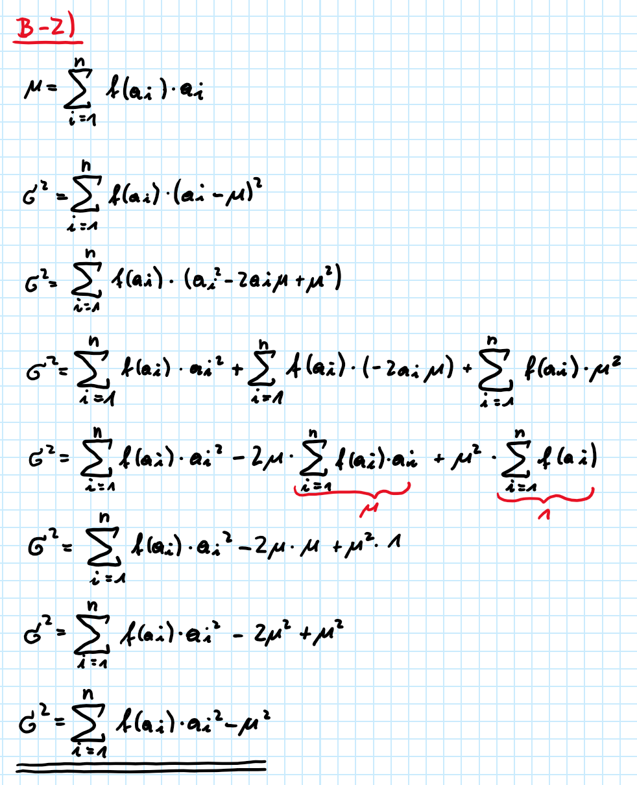

# A) TECHNISCHE FERTIGKEITEN\
## A-1) Handelt es sich bei den vorliegenden statistischen Gesamtheiten um Bestands- oder Bewegungsgrößen?
**a) Studierende an einer Hochschule.**
  * Bestandsgröße
**b) Hochzeiten am Standesamt einer Gemeinde.**
  * Bewegungsgröße
**c) Bei der Behörde gemeldete Personenkraftwagen.**
  * Bestandsgröße
**d) Maschinenausfälle in einer Werkstatt.**
  * Bewegungsgröße
**e) Wartende Kunden vor einem Abfertigungsschalter.**
  * Bestandsgröße
\
\

## A-2) Im Servicecenter eines Unternehmens werden über einen Zeitraum eines Tages die eingehenden Anrufe aufgezeichnet. Gezählt wird die Anzahl der pro 10-Minuten-Zeitintervall eingehenden Anrufe. Für 40 derartige Zeitintervalle erhält man folgende Ergebnisse:
```{r}
Liste.vec <- c(0, 0, 1, 3, 4, 1, 2, 2, 1, 1, 1, 2, 3, 0, 2, 0, 1, 3, 1, 2, 2, 0, 1, 1, 6, 1, 0, 2, 3, 1, 1, 4, 2, 3, 2, 0, 3, 0, 1, 2)
Liste.vec
```

##### **a) Was stellt bei dieser Fragestellung die statistische Grundgesamtheit dar? Was sind die beobachteten Merkmale der statistischen Einheiten und wie sind sie skaliert?**
* Grundgesamtheit
  * Die Grundgesamtheit setzt sich auch sen statistischen Einheiten zusammen. Die Grundgesamtheit sind die Anzahl der 10-Minuten-Zeitintervalle - (`r length(Liste.vec)`).
* Merkmale
  * Anzahl der 10-Minuten-Zeitintervalle (`r length(Liste.vec)`)
  * Anzahl der Anrufe über alle Zeitintervalle (`r sum(Liste.vec)`)
* Skalierung
  * Metrische Skalierung (Kardinalskala), die verhältnisskaliert ist

##### **b) Ermittle die absolute und relative Häufigkeitstabelle der eingehenden Anrufe und stelle die Häufigkeitsverteilung und Summenhäufigkeit grafisch dar.**
\
**Absolute Häufigkeit:**
```{r}
table(Liste.vec)
```

```{r}
barplot(table(factor(Liste.vec,levels=c(0,1,2,3,4,5,6))), ylim = c(0,15), xlab = "Anzahl der Anrufe innerhalb eines 10-Minuten_Zeitintervalls", ylab = "Absolute Häufigkeit", main = "Absolute Häufigkeitsverteilung", col = "blue")
```
\
**Relative Häufigkeit:**
```{r}
table(Liste.vec)/length(Liste.vec)
```

```{r}
barplot(table(factor(Liste.vec,levels=c(0,1,2,3,4,5,6)))/sum(table(Liste.vec)), ylim = c(0,0.4), xlab = "Anzahl der Anrufe innerhalb eines 10 min Zeitintervalls",ylab = "relative Häufigkeit", main = "Relative Häufigkeitsverteilung", col = "blue")
```
\
**Summenhäufigkeit**
```{r}
cumsum(table(Liste.vec))
```
```{r}
barplot(cumsum(table(factor(Liste.vec,levels = c(0,1,2,3,4,5,6))))/sum(table(Liste.vec)), ylim = c(0,1.2), xlab = "Anzahl der Anrufe innerhalb des Intervalls", ylab = "Relative Summenhäufigkeit", main = "Summenhäufigkeit", col = "blue")
abline(0.25, 0, lty = "dashed")
abline(0.5, 0, lty = "dashed", col = "red")
abline(0.75, 0, lty = "dashed")
```

##### **c) Schätze das arithmetische Mittel aus der grafischen Darstellung für die Häufigkeit und den Median aus der grafischen Darstellung für die Summenhäufigkeit.**
\
__*Arithmetisches Mittel:*__ Das arithmestische Mittel kann als Schwerpunkt der Häufigkeitsverteilung angesehen werden. In diesem Fall beträgt das arithmetische Mittel nach Abschätzung rund 1,5, da somit links und rechts der x-Achse in etwa gleich viele Werte sind.
\
__*Median:*__ Der Median wird über die y-Achse ermittelt. Der Median befindet sich dann auf der x-Achse an dem Punkt, an dem 50% des y-Werts erreicht sind. In diesem Fall ist der Median bei 1.

##### **d) Berechne die möglichen Lageparameter (Zentralmaße und Streumaße)**
\
**Zentralmaße:**
\
__*Modus*__
```{r}
getmode <- function(Liste.vec) {
   uniqv <- unique(Liste.vec)
   uniqv[which.max(tabulate(match(Liste.vec, uniqv)))]
}
mode <- getmode(Liste.vec)
mode
```
__*Median*__
```{r}
median(Liste.vec)
```
__*Arithmetisches Mittel*__
```{r}
mean(Liste.vec)
```
\
**Streumaße:**
\
__*Minimum*__
```{r}
Minimum <- min(Liste.vec)
Minimum

```
__*Maximum*__
```{r}
Maximum <- max(Liste.vec)
Maximum
```
__*Spannweite*__
```{r}
Spannweite <- range(Liste.vec)
Spannweite
```
__*Quantile*__
```{r}
quantile(Liste.vec)
```
__*Mittlere absolute Abweichung*__
```{r}
mean(abs(Liste.vec-mean(Liste.vec)))
```
__*Standardabweichung*__
```{r}
sd(Liste.vec)
```
##### **e) Stelle die Daten in einem Boxplot dar**
\
```{r}
boxplot(Liste.vec, col = "blue")
```
\
Besonders Auffällig ist bei diesem Boxplot bzw. den Werten aus der Liste, dass der Median und das erste Quartil (25% Quantil) zusammenfallen. Die Werte 4 Anrufe sowie 6 Anrufe innerhalb eines 10-Minuten_Zeitintervalls werden hier als Ausreißer aufgefasst und als Kreis dargestellt. 
\
\

## A-3) Eine Anzahl von 1000 Kleinmotoren weist folgende Lebensdauer auf:
```{r}
Klassen.vec <- c("[0,2]", "(2,4]", "(4,6]", "(6,8]", "(8,10]")
Anzahl.vec <- c(33,276,404,237,50)

Klassen.vec; Anzahl.vec
```
```{r}
Lebensdauer.df <- data.frame(Lebensdauer=Klassen.vec, Anzahl_Motoren=Anzahl.vec)

Lebensdauer.df
```
\
Ergänzung der vorgegebenen Liste um die Klassenbreite und die Klassenmitte
```{r}
Lebensdauer.df <- data.frame(Lebensdauer=Lebensdauer.df$Lebensdauer, Klassenmitte=c(1,3,5,7,9), Klassenbreite=rep(2,5), Anzahl_Motoren=Lebensdauer.df$Anzahl_Motoren)

Lebensdauer.df
```
\
Ergänzung der Tabelle um die relative Häufigkeitsverteilung und die Summenhäufigkeit
```{r}
RelHfgk.vec <- Lebensdauer.df$Anzahl_Motoren / sum(Lebensdauer.df$Anzahl_Motoren)

SumHfgk.vec <- cumsum(RelHfgk.vec)

Lebensdauer.df <- data.frame(Lebensdauer.df, RelHfgk.vec, SumHfgk.vec)

Lebensdauer.df
```

Ergänzung der Tabelle um die Häufigkeitsdichte
```{r}
HfgkDichte.vec <- Lebensdauer.df$RelHfgk.vec / Lebensdauer.df$Klassenbreite
  
Lebensdauer.df <- data.frame(Lebensdauer.df, Dichte=HfgkDichte.vec)

Lebensdauer.df
```

##### **a) Stelle die Häufigkeitsverteilung und Summenhäufigkeit grafisch dar.**
\
**Absolute Häufigkeitsverteilung**
```{r}
barplot(Lebensdauer.df$Anzahl_Motoren, names=Lebensdauer.df$Lebensdauer, col = "blue", xlab = "Lebensdauer in Jahre", ylab = "Anzahl der Motoren", main = "Absolute Häufigkeitsverteilung", ylim = c(0,500))
```
\
**Relative Häufigkeitsverteilung**
```{r}
barplot(Lebensdauer.df$Anzahl_Motoren / sum(Lebensdauer.df$Anzahl_Motoren), ylim = c(0,0.6), xlab = "Lebensdauer in Jahre", ylab = "rel. Häufigkeit", col = "blue", main = "Relative Häufigkeitsverteilung")
```
\
**Summenhäufigkeit**
```{r}
X.vec <- c(0,2,4,6,8,10)
Y.vec <- c(0, Lebensdauer.df$SumHfgk.vec)
plot(X.vec, Y.vec, type = "l", lty = 1, main = "Summenhäufigkeit", xlab = "max. Lebensdauer in Jahre", ylab = "rel. Häufigkeit")
points(X.vec, Y.vec)
lines(X.vec, Y.vec, type = "s", lty = 3)
abline(0.25, 0, lty = "dashed")
abline(0.5, 0, lty = "dashed", col = "red")
abline(0.75, 0, lty = "dashed")
```

##### **b) Schätze das arithmetische Mittel aus der grafischen Darstellung für die Häufigkeit und den Median aus der grafischen Darstellung für die Summenhäufigkeit.**
\
__*Arithmetisches Mittel - geschätzt:*__ Das arithmetische Mittel liegt bei rund 5. Beim Ablesen des arithmetischen Mittelwerts müssen links und rechts auf der x-Achse gleich viele Werte vorhanden sein.
\
__*Median:*__ Der Median liegt bei 50% auf der y-Achse und der Wert kann auf der x-Achse abgelesen werden. Der Median beträgt schätzungsweise bei 4.


##### **c) Bestimme der Anteil der Motoren mit über 6 Jahren Lebensdauer.**
\
```{r}
LangeLebensdauer.vec <- Lebensdauer.df$Anzahl_Motoren[4] + Lebensdauer.df$Anzahl_Motoren[5]

LangeLebensdauer.vec
```
Motoren mit Lebensdauern über 6 Jahren befinden sich in der Liste in den letzten beiden statistischen Einheiten. Über die [] kann auf spezielle Vektorelemente/Listenelemente zugegriffen werden. In diesem Fall wird auf die Listenelemente 4 und 5 zugegriffen und für die Anzahl der Motoren, die länger als 6 Jahre laufen, addiert. Somit laufen `r LangeLebensdauer.vec` Motoren länger als 6 Jahre.
\
**Lebensdauer von Motoren**
```{r}
barplot(Lebensdauer.df$Dichte, names=Lebensdauer.df$Lebensdauer, main = "Lebensdauer von Motoren", xlab = "Lebensdauer in Jahre", ylab = "Häufigkeitsdichte", ylim = c(0,0.3), space = 0, col = "blue")
```

##### **d) Berechne die möglichen Lageparameter (Zentralmaße und Streumaße).**
\
```{r}
Lebensdauer.vec <- c(rep(1,33), rep(3,276), rep(5,404), rep(7,237), rep(9,50))
```
\
**Zentralmaße:**
\
__*Modus*__
```{r}
getmode <- function(Lebensdauer.vec) {
   uniqv <- unique(Lebensdauer.vec)
   uniqv[which.max(tabulate(match(Lebensdauer.vec, uniqv)))]
}
getmode(Lebensdauer.vec)
```
__*Median*__
```{r}
median(Lebensdauer.vec)
```
__*Mittelwert*__
```{r}
Mittelwert <- sum(Lebensdauer.df$RelHfgk.vec * Lebensdauer.df$Klassenmitte)

Mittelwert
```
\
**Streumaße:**
\
__*Minimum*__
```{r}
min(Lebensdauer.vec)
```
__*Maximum*__
```{r}
max(Lebensdauer.vec)
```
__*Spannweite*__
```{r}
range(Lebensdauer.vec)
```
__*Quantile*__
```{r}
quantile(Lebensdauer.vec)
```
__*Standardabweichung*__
```{r}
sd(Lebensdauer.vec)
```
__*Mittlere absolute Abweichung*__
```{r}
mean(abs(Lebensdauer.vec-mean(Lebensdauer.vec)))
```
\
In diesem Beispiel ist der Modus 5. Da es 5 Jahre Lebensdauer nicht gibt, ist die richtige Antwort, dass der Modus das einseitig offene Intervall (4,6] ist. 
\
\

## A-4) Ein technisches Servicecenter zeichnet an 100 Tagen die Häufigkeit der Einsätze auf. Es ergibt sich folgende Tabelle:
```{r}
AnzahlTage.vec <- c(16,48,27,9)
AnzahlEinsätze.vec <- c("[0,10]", "(10,20]", "(20,30]", "(30,80]")
Service.df <- data.frame(Einsätze = AnzahlEinsätze.vec, Tage = AnzahlTage.vec)
```
```{r}
RelHfk.vec <- Service.df$Tage / sum(Service.df$Tage)
SumHfk.vec <- cumsum(RelHfk.vec)

Service.df <- data.frame(Service.df, relHfk = RelHfk.vec, sumHfk = SumHfk.vec)
```
```{r}
Service.df <- data.frame(Service.df, Klassenbreite=c(10,10,10,50), Klassenmitte=c(5,15,25,55))
```

```{r}
HfkDichte.vec <- Service.df$relHfk / Service.df$Klassenbreite

Service.df <- data.frame(Service.df, Dichte=HfkDichte.vec)

Service.df
```

##### **a) Stelle die Häufigkeitsverteilung und Summenhäufigkeit grafisch dar.** 
\
\
**Häufigkeitsverteilung**
```{r}
barplot(Service.df$Dichte, names=Service.df$Einsätze, col = "blue", main = "Häufigkeitsverteilung", xlab = "Anzahl Einsätze pro Tage", ylab = "Häufigkeitsdichte", space = 0, ylim = c(0,0.06))
```
\
Die oben dargestellte Häufigkeitsverteilung bildet die statistischen Einheiten in einheitlichen Klassenbreiten ab. Die Darstellung lässt den Trugschluss zu, dass die letzte statistische Einheit die gleiche Breite wie die anderen Klassen aufweist. Im gegensatz zu den anderen Einheiten ist die letzte statistische Einheit nicht 10 sondern 50 Einsätzte pro Tag breit. In der nachfolgenden Darstellung werden die Intervalle ignoriert und die absolute Anzahl der Einsätze pro Tag angezeigt. Diese Darstellung kann einfacher verständlich und besser anschaulich zeigen, mit welcher Häufigkeit Anrufe pro Tag auftreten.
```{r}
Service.vec <- c(rep(5,16), rep(15,48), rep(25,27), rep(55,9))
X2a4.vec <- c(0,10,20,30,80)
hist(Service.vec, X2a4.vec, main = "Häufigkeitsverteilung (andere Darstellung)", xlab = "Anzahl Einsätze pro Tag", ylab = "Häufigkeitsdichte", col = "blue")
barplot(Service.df$Dichte, names=Service.df$Einsätze, col = "blue", main = "Häufigkeitsverteilung", xlab = "Anzahl Einsätze pro Tage", ylab = "Häufigkeitsdichte", space = 0, ylim = c(0,0.06))
```
\

**Summenhäufigkeit**
```{r}
Xa4.vec <- c(0,10,20,30,80)
Ya4.vec <- c(0, Service.df$sumHfk)
plot(Xa4.vec, Ya4.vec, main = "Summenhäufigkeit", xlab = "Anzahl Anrufe pro Tag", ylab = "rel. Häufigkeit", type = "l", lty = 1)
points(Xa4.vec, Ya4.vec)
lines(Xa4.vec, Ya4.vec, type = "s", lty = 3)
abline(0.25, 0, lty = "dashed")
abline(0.75, 0, lty = "dashed")
abline(0.5, 0, lty = "dashed", col = "red")
```


##### **b) Schätze das arithmetische Mittel aus der grafischen Darstellung für die Häufigkeit und den Median aus der grafischen Darstellung für die Summenhäufigkeit.**
\
\
__*Arithmetisches Mittel:*__ Das aritmethische Mittel wird auf 19 geschätzt. Links und rechts auf der x-Achse müssen gleich viele Werte liegen, da das arithmetische Mittel den Schwerpunkt der Verteilung symbolisiert.
\
__*Median:*__ Der Median kann an der y-Achse ablesen werden. Genauer gesagt an der Stelle, an der die 50% Marke bei der relativen Häufigkeit im Summenhäufigkeitsdiagramm liegt. In diesem Fall wird der Median auf 16 geschätzt. 


##### **c) Bestimme der Anteil der Tage mit über 20 Einsätzen.**
\
```{r}
Stress.vec <- Service.df$relHfk[3] + Service.df$relHfk[4]
```
\
Die Fragestellung verlangt nach der expliziten Angabe der Einsätze über 20 Einsätze Pro Tage. Durch Addition der relativen Häufigkeit der dritten und vierten statistischen Einheiten kann die Häufigkeit bestimmt werden, mit der mehr als 20 Einätze pro Tag absolviert werden müssen. Bei der dritten statistischen Einheit wird der Intervall mit der unteren Grenze von 20 angegeben. Eine genaue Angabe, wie häufig Tage mit über 20 Einsätzen sind, kann daher an dieser Stelle nicht gemacht werden, da ebendieses Intervall auch 20 Einsätze enthält, in der Fragestellung aber explizit nach ÜBER 20 Einsätzen gefragt wird. Ohne Rücksichtnahme auf diese Unstimmigkeit beträgt die Häufigkeit von mehr als 20 Einsätzen pro Tag rund `r Stress.vec*100` %.


##### **d) Berechne die möglichen Lageparameter (Zentralmaße und Streumaße). Welcher Aspekt könnte hier problematisch sein? Warum?**
\
\
**Zentralmaße:**
\
__*Modus*__
```{r}
getmode <- function(Service.vec) {
   uniqv <- unique(Service.vec)
   uniqv[which.max(tabulate(match(Service.vec, uniqv)))]
}
getmode(Service.vec)
```
__*Median*__
```{r}
median(Service.vec)
```
__*Mittelwert*__
```{r}
Mittelwert <- sum(Service.df$RelHfgk.vec * Service.df$Klassenmitte)

Mittelwert
```
\
**Streumaße:**
\
__*Minimum*__
```{r}
min(Service.vec)
```
__*Maximum*__
```{r}
max(Service.vec)
```
__*Spannweite*__
```{r}
range(Service.vec)
```
__*Quantile*__
```{r}
quantile(Service.vec)
```
__*Standardabweichung*__
```{r}
sd(Service.vec)
```
__*Mittlere absolute Abweichung*__
```{r}
mean(abs(Service.vec-mean(Service.vec)))
```
Die Aussagekraft des Medians für die Mitte der Daten ist für diese Datenreihe zielführender, da das arithmetische Mittel auch Ausreißer mit berücksichtigt, was beim Median nicht der Fall ist.


# B) VERSTÄNDNISFRAGEN

## B-1) Zeige, dass das arithmetische Mittel unter dem Schwerpunkt der Häufigkeitsfunktion liegt.
Bild
\
\

## B-2) Verschiebungssatz zur Berechnung der Standardabweichung
\


\
\

## **B-3)** Das komma-separierte File **"Fehlerquote.csv"** enthält das Prüfergebnis von 50 Bauteilen auf Funktionstüchtigkeit. Dabei steht der Eintrag **"0"** für ein fehlerfreies Bauteil und **"1"** für ein fehlerhaftes Bauteil.
```{r}
Fehlerquote.df <- read.csv("Fehlerquote.csv", sep = ";", dec = ",", header = TRUE)
```

##### **a) Welche Skalierung hat dieses Merkmal?**
\
Die Skalierung dieses Merkmals entspricht einem normalskalierten dichotomem Merkmal.

##### **b) Stelle die Messergebnisse in einer Häufigkeitstabelle und grafisch dar.**
\
__*Häufigkeitstabelle:*__
```{r}
Fehlerquote.vec <- table(Fehlerquote.df$fehlerhaft)/length(Fehlerquote.df$fehlerhaft)
# Spalte 1 - Zustand 0/1:
Zustand.vec <- c("fehlerfrei - 0","fehlerhaft - 1")
# Spalte 2 - rel. Häufigkeit
Fehlerhaft.vec <- sum(Fehlerquote.df$fehlerhaft)/length(Fehlerquote.df$Nr.)
RelHfkFehlerquote.vec <- c((1-Fehlerhaft.vec),Fehlerhaft.vec)

HfgTabelle.df <- data.frame(Zustand = Zustand.vec, rel.Häufigkeit = RelHfkFehlerquote.vec)
HfgTabelle.df
```

```{r}
barplot(Fehlerquote.vec, main = "Häufigkeitsverteilung", xlab = "Fehler (0 = kein Fehler, 1 = Fehler)", ylab = "rel. Häufigkeit", ylim = c(0,1.2), col = "blue")
```

##### **c) Wie kann man in diesem Beispiel das arithmetische Mittel berechnen und wofür steht es in diesem Fall?**
\
Das arithmetische Mittel gibt hier nur an, wie viele Teile fehlerhaft sind, da die Bauteile mit 0, also fehlerfreie Bauteile, nicht miteinberechnet werden.

##### **d) Wie groß ist die Standardabweichung $\sigma$? Leite eine Formel her und zeige, wie man sie in diesem Fall einfach aus dem arithmetischen Mittel errechnen kann.**
\
__*Standardabweigung*__
```{r}
sd(Fehlerquote.df$fehlerhaft)
```
__*Standardabweichung über arithmetisches Mittel*__
```{r}

```

##### **e) Wie müssen die Verteilungen in diesem Fall sein, damit die Streuung maximal bzw. minimal wird?**
\
Test
\
\

## B-4) Das komma-separierte File **"Verteilungsvergleich.csv"** enthält in 4 Spalten die Daten von folgenden Messreihen: Ergebnis von 40 Würfeln mit einem Würfel (Annahme: gleichverteilt), die Zeitspanne (in Minuten) zwischen 40 vorbeifahrenden Autos (Annahme: exponentialverteilt), die Länge von 40 Telefongesprächen in Minuten (Annahme: normalverteilt) und die Länge von 40 Holzstiften in cm (Annahme: normalverteilt). Vergleiche die vier verschiedenen Verteilungen in den folgenden Fragen:
```{r}
Verteilungsvergleich.df <- read.csv("Verteilungsvergleich.csv", sep = ";", dec = ",", header = TRUE)
```


##### **a) Erstelle für jede Messreihe eine Häufigkeitstabelle sowie eine grafische Darstellung der Häufigkeitsverteilung und der Summenhäufigkeit.**
\
__*Würfel*__
```{r}
Würfel.df <- data.frame(Augenzahl = (1:6), abs.Häufigkeit = tabulate(Verteilungsvergleich.df$Wuerfel), rel.Häufigkeit = tabulate(Verteilungsvergleich.df$Wuerfel)/length(Verteilungsvergleich.df$Wuerfel))

Würfel.df <- data.frame(Würfel.df, Summenhfk. = cumsum(Würfel.df$rel.Häufigkeit))
Würfel.df
```
```{r}
barplot(Würfel.df$abs.Häufigkeit, names = Würfel.df$Augenzahl, ylim = c(0,10), main = "Absolute Häufigkeitsverteilung Würfel", xlab = "Augenzahl", ylab = "abs. Häufigkeit", col = "blue")
```
```{r}
barplot(Würfel.df$rel.Häufigkeit, names = Würfel.df$Augenzahl, col = "blue", main = "Relative Häufigkeitsverteilung Würfeln", xlab = "Augenzahl", ylab = "rel. Häufigkeit", ylim = c(0,0.25))
```
```{r}
plot(Würfel.df$Augenzahl, Würfel.df$Summenhfk., main = "Summenhäufigkeit Würfel", xlab = "Augenzahl", ylab = "rel. Häufigkeit", type = "l", lty = 1)
points(Würfel.df$Augenzahl, Würfel.df$Summenhfk.)
lines(Würfel.df$Augenzahl, Würfel.df$Summenhfk., type = "s", lty = 3)
abline(0.25, 0, lty = "dashed")
abline(0.75, 0, lty = "dashed")
abline(0.5, 0, lty = "dashed", col = "red")
```
__*Wartezeit*__
```{r}
Zeit.vec <- c(0,3,6,9,12,15,18)
Zeitintervalle.vec <- c("[0,3]", "(3,6]", "(6,9]", "(9,12]", "(12,15]", "(15,18]")
Klasse.vec <- tabulate(cut(Verteilungsvergleich.df$Wartezeit_min, breaks = Zeit.vec))
Wartezeit.df <- data.frame(Zeit = Zeitintervalle.vec, Klassenbreite = rep(3,6), Klassenmitte = c(1.5,4.5,7.5,10.5,13.5,16.5), abs.Häufigkeit = Klasse.vec, rel.Häufigkeit = Klasse.vec/length(Verteilungsvergleich.df$Wartezeit_min))

Wartezeit.df <- data.frame(Wartezeit.df, Summenhfk. = cumsum(Wartezeit.df$rel.Häufigkeit), Dichte = Wartezeit.df$rel.Häufigkeit/Wartezeit.df$Klassenbreite)
Wartezeit.df
```
```{r}
barplot(Wartezeit.df$abs.Häufigkeit, names = Wartezeit.df$Zeit, main = "Absolute Häufigkeitsverteilung Wartezeit", xlab = "Wartezeit in min", ylab = "abs. Häufigkeit", col = "blue", ylim = c(0,25))
```
```{r}
barplot(Wartezeit.df$Dichte, names = Wartezeit.df$Zeit, main = "Histogramm Wartezeit", xlab = "Wartezeit in min", ylab = "Häufigkeitsdichte", space = 0, col = "blue", ylim = c(0,0.2))
```
```{r}
plot(c(0,3,6,9,12,15,18), c(0,Wartezeit.df$Summenhfk.), main = "Summenhäufigkeit Wartezeit", xlab = "Wartezeit in min", ylab = "rel. Häufigkeit", type = "l", lty = 1)
points(c(0,3,6,9,12,15,18), c(0,Wartezeit.df$Summenhfk.))
lines(c(0,3,6,9,12,15,18), c(0,Wartezeit.df$Summenhfk.), type = "s", lty = 3)
abline(0.25, 0, lty = "dashed")
abline(0.75, 0, lty = "dashed")
abline(0.5, 0, lty = "dashed", col = "red")
```
\
__*Telegespräche*__
```{r}
Dauer.vec <- c(0,2,4,6,8,10,12,14,16)
Dauer_Intervall.vec <- c("[0,2]", "(2,4]", "(4,6]", "(6,8]", "(8,10]", "(10,12]", "(12,14]", "(14,16]")
Dauer_Klasse.vec <- tabulate(cut(Verteilungsvergleich.df$Telgesprae_min, breaks = Dauer.vec))
Gesprächsdauer.df <- data.frame(Gesprächsdauer = Dauer_Intervall.vec, Klassenbreite = rep(2,8), Klassenmitte = c(1,3,5,7,9,11,13,15), abs.Häufigkeit = Dauer_Klasse.vec, rel.Häufigkeit = Dauer_Klasse.vec/length(Verteilungsvergleich.df$Telgesprae_min))

Gesprächsdauer.df <- data.frame(Gesprächsdauer.df, Summenhfk. = cumsum(Gesprächsdauer.df$rel.Häufigkeit), Dichte = Gesprächsdauer.df$rel.Häufigkeit/Gesprächsdauer.df$Klassenbreite)

Gesprächsdauer.df
```
```{r}
barplot(Gesprächsdauer.df$abs.Häufigkeit, names = Gesprächsdauer.df$Gesprächsdauer, ylim = c(0,35), col = "blue", main = "Absolute Häufigkeit Dauer Telefongespräche", ylab = "abs. Häufigkeit", xlab = "Gesprächsdauer in min")
```
```{r}
barplot(Gesprächsdauer.df$Dichte, names = Gesprächsdauer.df$Gesprächsdauer, ylim = c(0,0.5), col = "blue", main = "Histogram Dauer Telefongespräch", ylab = "Häufigkeitsdichte", xlab = "Gesprächsdauer in min", space = 0)
```
```{r}
plot(c(0,2,4,6,8,10,12,14,16), c(0,Gesprächsdauer.df$Summenhfk.), main =  "Summenhäufigkeit Telefongespräch", xlab = "Gesprächsdauer in min", ylab = "rel. Häufigkeit", type = "l", lty = 1)
points(c(0,2,4,6,8,10,12,14,16), c(0,Gesprächsdauer.df$Summenhfk.))
lines(c(0,2,4,6,8,10,12,14,16), c(0,Gesprächsdauer.df$Summenhfk.), type = "s", lty = 3)
abline(0.25, 0, lty = "dashed")
abline(0.75, 0, lty = "dashed")
abline(0.5, 0, lty = "dashed", col = "red")
```
__*Stiftlänge*__
```{r}
Länge.vec <- c(3.3,3.4,3.5,3.6,3.7,3.8)
Länge_Intervall.vec <- c("[3.3,3.4]", "(3.4,3.5]", "(3.5,3.6]", "(3.6,3.7]", "(3.7,3.8]")
Länge_Klasse.vec <- tabulate(cut(Verteilungsvergleich.df$Stiftlaenge_cm, breaks = Länge.vec))
Stiftlänge.df <- data.frame(Stiftlänge = Länge_Intervall.vec, Klassenbreite = rep(0.1,5), Klassenmitte = c(3.35,3.45,3.55,3.65,3.75), abs.Häufigkeit = Länge_Klasse.vec, rel.Häufigkeit = Länge_Klasse.vec/length(Verteilungsvergleich.df$Stiftlaenge_cm))

Stiftlänge.df <- data.frame(Stiftlänge.df, Summenhfk. = cumsum(Stiftlänge.df$rel.Häufigkeit), Dichte = Stiftlänge.df$rel.Häufigkeit/Stiftlänge.df$Klassenbreite)

Stiftlänge.df
```
```{r}
barplot(Stiftlänge.df$abs.Häufigkeit, names = Länge_Intervall.vec, main = "Absolute Häufigkeit Stiftlänge", ylab = "abs. Häufigkeit", ylim = c(0,20), xlab = "Stiftlänge in cm", col = "blue")
```
Aufgrund der unglücken Wahl der Maße in cm und der geringen Steuung sowie der folglichen geringen Klassenbreite, wird hier kein Diagramm der Häufigkeitsdichte, sondern ein Diagramm der rel. Häufigkeit erstellt. 
```{r}
barplot(Stiftlänge.df$rel.Häufigkeit, names = Länge_Intervall.vec, space = 0, col = "blue", ylim = c(0,0.4), xlab = "Stiftlänge in cm", ylab = "rel. Häufigkeit", main = "Relative Häufigkeitsverteilung Stiftlänge")
```
```{r}
plot(c(3.3,3.4,3.5,3.6,3.7,3.8), c(0,Stiftlänge.df$Summenhfk.), main = "Summenhäufigkeit Stiftlänge", xlab = "Stiftlänge in cm", ylab = "rel. Häufigkeit", type = "l", lty = 1)

points(c(3.3,3.4,3.5,3.6,3.7,3.8), c(0,Stiftlänge.df$Summenhfk.))
lines(c(3.3,3.4,3.5,3.6,3.7,3.8), c(0,Stiftlänge.df$Summenhfk.), type = "s", lty = 3)
abline(0.25, 0, lty = "dashed")
abline(0.75, 0, lty = "dashed")
abline(0.5, 0, lty = "dashed", col = "red")
```

##### **b) Schätze das arithmetische Mittel aus der grafischen Darstellung für die Häufigkeit und den Median aus der grafischen Darstellung für die Summenhäufigkeit.**
\
\
__*Würfel:*__\
arithmetisches Mittel: 3,5\
Median: 3
\
\
__*Wartezeit:*__
\
\
arithmetisches Mittel: liegt im Intervall [0,3] und beträgt geschätzt 3\
Median: 2,8
\
\
__*Telefongespräche:*__\
arithmetisches Mittel: liegt im Intervall (2,4] und beträgt geschätzt 3\
Median: 3,5
\
\
__*Stiftlänge:*__\
arithmetisches Mittel: liegt im Intervall (3.5,3.6] und beträgt geschätzt 3,55\
Median: 3,51\


##### **c) Bestimme für jede Messreihe jene Merkmalsausprägung, unter welcher die kleinsten 25 % zu finden sind.**

##### **d) Berechne die möglichen Lageparameter (Zentralmaße und Streumaße). Versuche die Lage und die Größe der Lageparameter aufgrund der Eigenschaften der Verteilungen zu verstehen. (z.B.: Worauf deutet die verschiedenen Lage von Median und arithmetischem Mittel, wie verhält sich die Standardabweichung zu Streuparametern wie Spannweite oder Interquartilsabstand?)**
\
\
**Würfel - Zentralmaße:**
\
__*Modus*__
```{r}
Modus_Wuerfel.vec <- Verteilungsvergleich.df$Wuerfel
getmode <- function(Modus_Wuerfel.vec) {
   uniqv <- unique(Modus_Wuerfel.vec)
   uniqv[which.max(tabulate(match(Modus_Wuerfel.vec, uniqv)))]
}
getmode(Modus_Wuerfel.vec)
```
__*Median*__
```{r}
median(Verteilungsvergleich.df$Wuerfel)
```
__*Mittelwert*__
```{r}
mean(Verteilungsvergleich.df$Wuerfel)
```
\
**Würfel - Streumaße**
\
__*Minimum*__
```{r}
min(Verteilungsvergleich.df$Wuerfel)
```
__*Maximum*__
```{r}
max(Verteilungsvergleich.df$Wuerfel)
```
__*Spannweite*__
```{r}
range(Verteilungsvergleich.df$Wuerfel)
```
__*Quantile*__
```{r}
quantile(Verteilungsvergleich.df$Wuerfel)
```
__*Standardabweichung*__
```{r}
sd(Verteilungsvergleich.df$Wuerfel)
```
__*Mittlere absolute Abweichung*__
```{r}
mean(abs(Verteilungsvergleich.df$Wuerfel-mean(Verteilungsvergleich.df$Wuerfel)))
```
\
\
**Wartezeit - Zentralmaße:**
\
__*Modus*__
```{r}
Modus_Wartezeit.vec <- Verteilungsvergleich.df$Wartezeit_min
getmode <- function(Modus_Wartezeit.vec) {
   uniqv <- unique(Modus_Wartezeit.vec)
   uniqv[which.max(tabulate(match(Modus_Wartezeit.vec, uniqv)))]
}
getmode(Modus_Wartezeit.vec)
```
__*Median*__
```{r}
median(Verteilungsvergleich.df$Wartezeit_min)
```
__*Mittelwert*__
```{r}
mean(Verteilungsvergleich.df$Wartezeit_min)
```
\
**Wartezeit - Streumaße**
\
__*Minimum*__
```{r}
min(Verteilungsvergleich.df$Wartezeit_min)
```
__*Maximum*__
```{r}
max(Verteilungsvergleich.df$Wartezeit_min)
```
__*Spannweite*__
```{r}
range(Verteilungsvergleich.df$Wartezeit_min)
```
__*Quantile*__
```{r}
quantile(Verteilungsvergleich.df$Wartezeit_min)
```
__*Standardabweichung*__
```{r}
sd(Verteilungsvergleich.df$Wartezeit_min)
```
__*Mittlere absolute Abweichung*__
```{r}
mean(abs(Verteilungsvergleich.df$Wartezeit_min-mean(Verteilungsvergleich.df$Wartezeit_min)))
```
\
\
**Telefongespräch - Zentralmaße:**
\
__*Modus*__
```{r}
Modus_Telefongespräch.vec <- Verteilungsvergleich.df$Telgesprae_min
getmode <- function(Modus_Telefongespräch.vec) {
   uniqv <- unique(Modus_Telefongespräch.vec)
   uniqv[which.max(tabulate(match(Modus_Telefongespräch.vec, uniqv)))]
}
getmode(Modus_Telefongespräch.vec)
```
__*Median*__
```{r}
median(Verteilungsvergleich.df$Telgesprae_min)
```
__*Mittelwert*__
```{r}
mean(Verteilungsvergleich.df$Telgesprae_min)
```
\
**Telefongespräche - Streumaße:**
\
__*Minimum*__
```{r}
min(Verteilungsvergleich.df$Telgesprae_min)
```
__*Maximum*__
```{r}
max(Verteilungsvergleich.df$Telgesprae_min)
```
__*Spannweite*__
```{r}
range(Verteilungsvergleich.df$Telgesprae_min)
```
__*Quantile*__
```{r}
quantile(Verteilungsvergleich.df$Telgesprae_min)
```
__*Standardabweichung*__
```{r}
sd(Verteilungsvergleich.df$Telgesprae_min)
```
__*Mittlere absolute Abweichung*__
```{r}
mean(abs(Verteilungsvergleich.df$Telgesprae_min-mean(Verteilungsvergleich.df$Telgesprae_min)))
```
\
\
**Stiftlänge - Zentralmaße:**
\
__*Modus*__
```{r}
Modus_Stiftlänge.vec <- Verteilungsvergleich.df$Stiftlaenge_cm
getmode <- function(Modus_Stiftlänge.vec) {
   uniqv <- unique(Modus_Stiftlänge.vec)
   uniqv[which.max(tabulate(match(Modus_Stiftlänge.vec, uniqv)))]
}
getmode(Modus_Stiftlänge.vec)
```
__*Median*__
```{r}
median(Verteilungsvergleich.df$Stiftlaenge_cm)
```
__*Mittelwert*__
```{r}
mean(Verteilungsvergleich.df$Stiftlaenge_cm)
```
\
**Stiftlänge - Streumaße:**
\
__*Minimum*__
```{r}
min(Verteilungsvergleich.df$Stiftlaenge_cm)
```
__*Maximum*__
```{r}
max(Verteilungsvergleich.df$Stiftlaenge_cm)
```
__*Spannweite*__
```{r}
range(Verteilungsvergleich.df$Stiftlaenge_cm)
```
__*Quantile*__
```{r}
quantile(Verteilungsvergleich.df$Stiftlaenge_cm)
```
__*Standardabweichung*__
```{r}
sd(Verteilungsvergleich.df$Stiftlaenge_cm)
```
__*Mittlere absolute Abweichung*__
```{r}
mean(abs(Verteilungsvergleich.df$Stiftlaenge_cm-mean(Verteilungsvergleich.df$Stiftlaenge_cm)))
```
\

##### **e) Zeichne für jede Messreihe einen Boxplot**
\
```{r}
boxplot(Verteilungsvergleich.df$Wuerfel, col = "blue", main = "Würfel", ylab = "Augenzahl")
```
```{r}
boxplot(Verteilungsvergleich.df$Wartezeit_min, col = "blue", ylab = "Wartezeit in min", main = "Wartezeit")
```
```{r}
boxplot(Verteilungsvergleich.df$Telgesprae_min, main = "Telefongespräch", ylab = "Dauer Telefongespräch", col = "blue")
```
```{r}
boxplot(Verteilungsvergleich.df$Stiftlaenge_cm, main = "Stiftlänge", ylab = "Stiftlänge in cm", col = "blue")
```


## **B-5)** Lageparameter als Sicherheitskennzahlen. Eine Fluggesellschaft wirbt damit, dass pro 489 Millionen Passagierkilometer lediglich 1 Todesfall zu beklagen war. (Das klingt sehr gut, wenn man nur 800 km fliegen will). Mit dieser Statistik, so die Fluggesellschaft, ist die Reise mit ihr 10-mal sicherer als eine Autofahrt. (m.a.W.: Im Autoverkehr gibt es 10 Tote auf 48 Millionen Passagierkilometer, oder 1 Toten auf 4,8 Mio. Passagierkilometer.) Allerdings fliegt das Flugzeug im Durchschnitt auch 10-mal schneller als ein Auto fährt. Welche Kennzahlen würde eine Pro-Auto-Initiative dieser Werbung entgegenstellen? (Beachte die effektiven Reisezeiten.)
Wie sich aus der Statistik ableiten lässt, ist laut Fluggesellschaft das Fliegen rund 10 Mal sicherer als eine Autofahrt. Gleichzeitig wird aber auch angegeben, dass ein Flugzeug im Durchschnitt auch 10 Mal so schnell fliegt, als ein Auto fährt. Innerhalb eines gleichen Zeitabschnitts legt ein Flugzeug 48 Mio. Kilometer zurück, ein Auto hingegen nur 4,8 Mio Kilometer. Aus der Angabe geht hervor, dass für beide Strecken jeweils ein Todesopfer zu beklagen ist. Das Sterberisiko ist zwar pro Kilometer Flugstrecke geringer als pro Kilometer Autofahrt, Für eine bestimmte Reisezeit ist das Risiko zu Sterben allerdings gleich groß. Die Pro-Auto-Initiative könnte also angeben, dass pro Reisestunde das Sterberisiko bei einer Autofahrt gleich groß ist wie bei der Reise mit einem Flugzeug. 
\
\


## **B-6)** Will Rogers Phänomen. 
Text
\
\


## **B-7)** Simpsons Paradoxon.
Text
\
\


## **B-8)** Studienplatz an einer Hochschule
Text 
\
\

## **C-1)** Offene Untersuchung: Das komma-separierte File „Unternehmensumsaetze.csv“ enthält Daten zu den 97 weltweit größten und börsennotierten Konzernen. In dieser Tabelle sind die Umsätze und Gewinne in Mrd. $ angegeben. Untersuche die Daten mit den bekannten Methoden. Beantworte damit Fragen, wie z.B.: \ „Wie verteilen sich die Unternehmen auf Länder und Branchen?“, \ „Wie verteilen sich Gewinne, Umsätze und Mitarbeiter?“, \ „Welche Branchen generieren besonders viele Umsätze oder Gewinne pro Mitarbeiter?“, und andere mehr. Verwende dazu geeignete Häufigkeitsdarstellungen und Lageparameter.\ Lege eine passende Regressionsgerade durch die Merkmale „Mitarbeiter“ und „Gewinn“. Wo gibt es Ausreißer. Erkundige Dich nach der Lorenzkurve und wende sie auf die Werte der Merkmale „Umsätze“ und „Mitarbeiter“ an.
\
**Verteilung der Unternehmen nach den Branchen**
```{r}
Unternehmensumsätze.df <- read.csv("Unternehmensumsaetze.csv", sep = ";", dec = ",", header = TRUE)
```
\
**Verteilung der Unternehmen nach den jeweiligen Länder in dem das Unternehmen seinen Hauptwohnsitz hat**
```{r}
Land.df <- data.frame(table(Unternehmensumsätze.df$Land)) 
names(Land.df) <- c("Staat" , "Anzahl") 
Land.df[order(Land.df$Anzahl, decreasing = TRUE),]
```
\
\
**Verteilung der Unternehmen nach Branchen**
```{r}
Branche.df <- data.frame(table(Unternehmensumsätze.df$Branche))
names(Branche.df) <- c("Branche", "Anzahl")
Branche.df[order(Branche.df$Anzahl, decreasing = TRUE),]
```
\
\
**Verteilung der Unternehmen nach Hauptsitz**
```{r}
Hauptsitz.df <- data.frame(table(Unternehmensumsätze.df$Hauptsitz)) 
names(Hauptsitz.df) <- c("Hauptsitz" , "Anzahl") 
Hauptsitz.df[order(Hauptsitz.df$Anzahl, decreasing = TRUE),]
```
\
\
**Aufteilung nach Unternehmensumsätze**
```{r}
summary(Unternehmensumsätze.df$Umsatz)
```

```{r}
hist(Unternehmensumsätze.df$Umsatz, c(0,25,50,75,100,125,150,175,200,225,250,275,300,325,350,375,400,425,450,475,500), col = "blue", main = "Histogramm der Unternehmensumsätze", xlab = "Umsatz in Mrd. $", ylab = "Anzahl der Unternehmen", ylim = c(0,40))
```
\
\
**Aufteilung nach Unternehmensgewinnen**
```{r}
summary(Unternehmensumsätze.df$Gewinn)
```
```{r}
Breaks.vec <- c(-20,-10,0,10,20,30,40,50,60,70,80,90)

hist(Unternehmensumsätze.df$Gewinn, Breaks.vec, main = "Histogramm der Unternehmensgewinne", xlab = "Gewinn in Mrd. $", ylab = "Anzahl der Unternehmen", col = "blue", xlim = c(-20,100))
```
\
\
**Sortierung nach Umsatz je Mitarbeiter in $**
```{r}
Mitarbeit_Bran.vec <- aggregate(Unternehmensumsätze.df$Mitarbeiter, by = list(Branche = Unternehmensumsätze.df$Branche), FUN = sum)

Umsatz_Bran.vec <- aggregate(Unternehmensumsätze.df$Umsatz, by = list(Branche = Unternehmensumsätze.df$Branche), FUN = sum)

Umsatz_Mitarbeit_Bran.df <- data.frame(Bran = Umsatz_Bran.vec$Branche, Ums_Mit = 1000000000*Umsatz_Bran.vec$x/Mitarbeit_Bran.vec$x)

names(Umsatz_Mitarbeit_Bran.df) <- c("Branche", "Umsatz_je_Mitarbeiter")
Umsatz_Mitarbeit_Bran.df[order(Umsatz_Mitarbeit_Bran.df$Umsatz_je_Mitarbeiter, decreasing = TRUE),]
```
Im Rohstoffsektor und im Pharmaunternehmen sind die vergleichsweise größten Gewinne je Mitarbeiter zu erzielen. Im Rohstoffhandel betragen die Umsätze rund 4,6 Mio. \$ je Mitarbeiter.

\
\
**Sortierung nach Gewinn je Mitarbeiter nach Branche in $**
```{r}
Gewinn_Bran.vec <- aggregate(Unternehmensumsätze.df$Gewinn, by = list(Branche = Unternehmensumsätze.df$Branche), FUN = sum)

Gewinn_Mitarbeit_Bran.df <- data.frame(Bran = Gewinn_Bran.vec$Branche, Gew_Mit = 1000000000*Gewinn_Bran.vec$x/Mitarbeit_Bran.vec$x)

names(Gewinn_Mitarbeit_Bran.df) <- c("Branche", "Gewinn_je_Mitarbeiter")
Gewinn_Mitarbeit_Bran.df[order(Gewinn_Mitarbeit_Bran.df$Gewinn_je_Mitarbeiter, decreasing = TRUE),]
```
Die höchsten Gewinne je Mitarbeiter können mit rund 570.00 \$ je Mitarbeiter die Unternehmen in der Pharmazie aufweisen. 
\
\
**Sortierung nach Gewinn je Mitarbeiter nach Unternehmen in $**
```{r}
Mitarbeit_Firma.vec <- aggregate(Unternehmensumsätze.df$Mitarbeiter, by = list(Firma = Unternehmensumsätze.df$Name), FUN = sum)

Gewinn_Firma.vec <- aggregate(Unternehmensumsätze.df$Gewinn, by = list(Firma = Unternehmensumsätze.df$Name), FUN = sum)

Gewinn_Mitarbeit_Firma.df <- data.frame(Firma = Gewinn_Firma.vec$Firma, Gew_Mit = 1000000000*Gewinn_Firma.vec$x/Mitarbeit_Firma.vec$x)

names(Gewinn_Mitarbeit_Firma.df) <- c("Firma", "Gewinn_je_Mitarbeiter")
Gewinn_Mitarbeit_Firma.df[order(Gewinn_Mitarbeit_Firma.df$Gewinn_je_Mitarbeiter, decreasing = TRUE),]
```
\
\
**Regressionsgerade durch die Merkmale "Mitarbeiter" und "Gewinn"**
```{r}
plot(Unternehmensumsätze.df$Mitarbeiter/1000000, Unternehmensumsätze.df$Gewinn, main = "Regression Mitarbeiter/Gewinn", xlab = "Mitarbeiter in Mio.", ylab = "Gewinn")
abline(lm(Unternehmensumsätze.df$Gewinn~Unternehmensumsätze.df$Mitarbeiter), col = "red")
```
\
Den größten Ausreißer, also das Unternehmen, das den größten Gewinn je Mitarbeiter erzielt, gibt es bei der Firma Fanni Mae mit fast 12 Mrd. \$ Gewinn je Mitarbeiter. Berechnet wird dieser Ausreißer in der vorherigen Berechnung bei "Sortierung nach Gewinn je Mitarbeiter nach Unternehmen in \$"

\
\
**Lorenzkurve angewandt auf die Merkmale "Umsätze" und "Mitarbeiter"**
```{r}
"ineq" %in% installed.packages()
#install.packages("ineq")
library(ineq)

plot(Lc(Unternehmensumsätze.df$Mitarbeiter, Unternehmensumsätze.df$Umsatz), main = "Umsätze je Mitarbeiter", xlab = "Mitarbeiter", ylab = "Umsätze")
```
