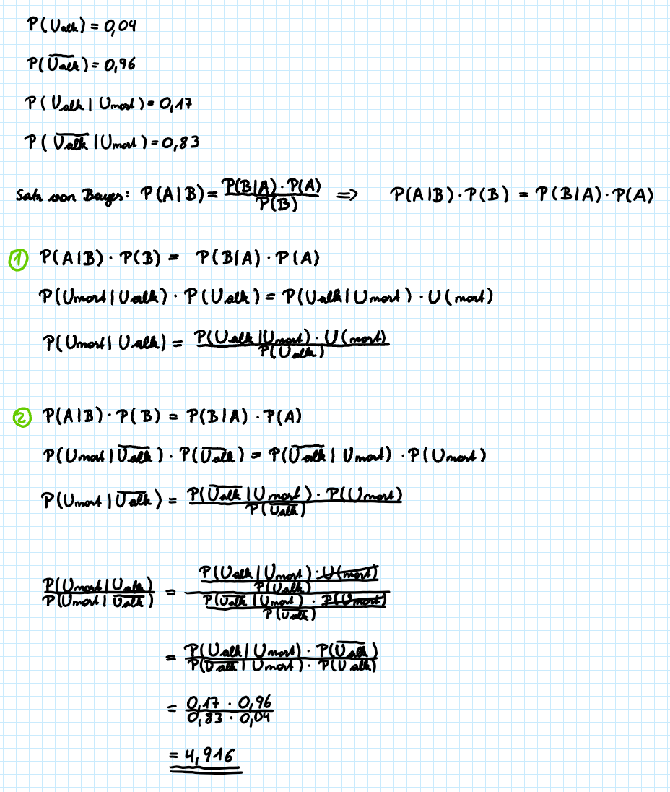

#### 1) Simuliere die Folge von 100 Münzwürfen mit dem Computer. Wir gehen dabei von einer „fairen“ Münze aus, d.h. von einer Münze, die nach einem Wurf zu je 50 % „Kopf“ oder „Zahl“ zeigt. Erzeuge dazu ein Feld (einen Vektor) mit 100 Komponenten, in den mit je 50 % Wahrscheinlichkeit „0“ („Kopf“) oder „1“ („Zahl“) eingetragen werden. Betrachte die entstehenden Muster. Wie oft treten 3 oder mehrere gleiche Ergebnisse in Serie auf? Wie (statistisch) bedeutsam sind diese Häufungen von Ereignissen?
```{r}
N <- 100
# Mit floor wird die Zufallszahl auf die nächste kleinere Ganzzahl abgerundet.
# runif erzeugt N gleichverteilte Zufallszahlen
Muenzwurf.vec <- floor(runif(N) * 2)
Muenzwurf.vec
# Speichern des zufälligen Ausgangsvektors für die Feststellung der Nuller-Serien
Muenzwurf0.vec <- Muenzwurf.vec
```
```{r}
# Definition einer Variable für die Seriengröße. Dies ermöglicht eine Veränderung an dieser Stelle, ohne jeden Wert einzeln anpassen zu müssen.
n <- 12
```

Im folgenden wird angenommen, dass eine Serie aus maximal `r n` Elementen bestehen kann. 
```{r}
# ablegen der Zufallszahlen in einer Tabelle
Serie.df <- data.frame(Seriengröße = c(1:n), Anzahl_Zahl = rep(0,n), Anzahl_Kopf = rep(0,n))
# Bestimmung der Anzahl 1er - also Zahl - der N Münzwürfe
N1 <- sum(Muenzwurf.vec)
# Shiften des Vektors Muenzwurf1.vec, da alle alleinstehenden 1er gezählt worden sind. Es verbleiben noch 2er und längere Gruppen 1er.
Muenzwurf1.vec <- Muenzwurf.vec * c(0,Muenzwurf.vec[-length(Muenzwurf.vec)])
# Die Summe an einzelnen 1ern in der Folge wird gezählt
N2 <- sum(Muenzwurf1.vec + c(Muenzwurf1.vec[-1],0) > 0)
Serie.df$Anzahl_Zahl[1] <- N1-N2

# In der Schleife werden alle 1er Folgen mit 2 oder mehr aufeinanderfolgenden 1er gezählt. Die Zählung funktioniert nach demselben Prinzip über Shifting und Zählen wie bereits bei den alleinstehenden 1ern.
i <- 2
while (i <= n) {
  Muenzwurf.vec <- Muenzwurf1.vec
  N1 <- sum(Muenzwurf.vec)
  Muenzwurf1.vec <- Muenzwurf.vec * c(0,Muenzwurf.vec[-length(Muenzwurf.vec)])
  N2 <- sum(Muenzwurf1.vec + c(Muenzwurf1.vec[-1],0) > 0)
  Serie.df$Anzahl_Zahl[i] <- N1-N2
  i <- i + 1
}

Serie.df
```
```{r}
# Es werden alle Nuller auf 1 gesetzt und alle 1er auf Null
Muenzwurf.vec <- (Muenzwurf0.vec == 0) * 1

# Die Zählung der Nullen im Vektor erfolgt auf dieselbe Weise wie die oben bereits beschriebene Variante der Zählung der 1er in der Zufallszahlenfolge.
N1 <- sum(Muenzwurf.vec)
Muenzwurf1.vec <- Muenzwurf.vec * c(0,Muenzwurf.vec[-length(Muenzwurf.vec)])
N2 <- sum(Muenzwurf1.vec + c(Muenzwurf1.vec[-1],0) > 0)
Serie.df$Anzahl_Kopf[1] <- N1-N2

i <- 2
while (i <= n) {
  Muenzwurf.vec <- Muenzwurf1.vec
  N1 <- sum(Muenzwurf.vec)
  Muenzwurf1.vec <- Muenzwurf.vec * c(0,Muenzwurf.vec[-length(Muenzwurf.vec)])
  N2 <- sum(Muenzwurf1.vec + c(Muenzwurf1.vec[-1],0) > 0)
  Serie.df$Anzahl_Kopf[i] <- N1-N2
  i <- i + 1
}

Serie.df
```
```{r}
i <- 3
Zahl <- 0
Kopf <- 0
SerieGroesserGleich3_1 <- 0
SerieGroesserGleich3_0 <- 0

# Zählschleife zur Ermittlung der Anzahl an Kopf (0) und Zahl (1) Serien mit mehr oder gleich 3 gleichen aufeinanderfolgenend Münzwürfen
while (i <= n) {
  Zahl <- Serie.df$Anzahl_Zahl[i]
  Kopf <- Serie.df$Anzahl_Kopf[i]
  SerieGroesserGleich3_1 <- SerieGroesserGleich3_1 + Zahl
  SerieGroesserGleich3_0 <- SerieGroesserGleich3_0 + Kopf
  i <- i + 1
}
SerieGroesserGleich3_1
SerieGroesserGleich3_0

# Summe der Folge mit mehr oder gleich 3 gleichen Münzwürfen hintereinander
SerieGroesserGleich3 <- SerieGroesserGleich3_0 + SerieGroesserGleich3_1
SerieGroesserGleich3

```
Die Auswertung der Zufallsdaten hat ergeben, dass es bei den zufälligen Münzwürfen mit identischer Wahrscheinlichkeit insgesamt `r SerieGroesserGleich3` Serien gibt, die 3 oder mehr Elemente enthält. Dabei entfallen `r SerieGroesserGleich3_1` Serien, bei denen der Münzwurf das Ergenbins "Zahl" und `r SerieGroesserGleich3_0` bei denen der Münzwurf das Ergebnis "Kopf" ist.  
\
**Statistische Bedeutsamkeit**\
Die Wahrscheinlichkeit, dass beim Münzwurf mit einer fairen Münze dasselbe Ergebnis 3 Mal hintereinander auftritt, beträgt P("Zahl" und "Zahl" und "Zahl") = P(1 * 1 * 1) = 0,5 * 0,5 * 0,5 = (1/2)^3 = 1/8. Bei 4 gleichen Ereignissen hintereinander wäre die Wahrscheinlichkeit nur noch 6,25 %. Kommt es zu einer Häufung von solchen Serien mit drei oder mehr gleichen Münzwürfen hintereinander, gehen Teilnehmer diese Münzwurfspiels davon aus, dass etwas nicht stimmt und dass es sich vermutlich nicht um eine faire Münze handelt, bei des sowohl "Zahl" als auch "Kopf" gleich wahrscheinlich vorkommen.
\
\

#### 2) Simuliere die Folge von 100 Würfen eines Würfels mit dem Computer. Wir gehen dabei von einem „fairen“ Würfel aus, bei dem die Zahl „6“ mit einer Wahrscheinlichkeit von 1/6 gewürfelt wird.
**Erzeuge dazu ein Feld (einen Vektor) mit 100 Komponenten, in den mit 1/6 Wahrscheinlichkeit „1“ („Sechs“) oder mit Wahrscheinlichkeit 5/6 „0“ („nicht Sechs“) eingetragen werden. Betrachte die entstehenden Muster. Wie oft treten 3 oder mehrere Sechser in Serie auf?**
```{r}
X.vec <- 1:100
Wuerfeln.vec <- floor(runif(length(X.vec),1,7))
Wuerfeln.vec
# Alle 6er werden auf 1 gesetzt, die restlichen Zahlen werden 0 gesetzt
Wuerfelwahrscheinlichkeit.vec <- (Wuerfeln.vec == 6) * 1
Wuerfelwahrscheinlichkeit.vec
Wuerfelwahrscheinlichkeit0.vec <- Wuerfelwahrscheinlichkeit.vec
```
```{r}
n <- 5
```

Es wird angenommen, dass nicht öfter als `r n` Mal hintereinander die Zahl 6 gewürfelt wird.
```{r}
Wuerfelserie.df <- data.frame(Seriengröße = c(1:n), Anzahl_6 = rep(0,n))
# Anzahl der gewürfelten 6er
N1 <- sum(Wuerfelwahrscheinlichkeit.vec)
Wuerfelwahrscheinlichkeit1.vec <- Wuerfelwahrscheinlichkeit.vec * c(0,Wuerfelwahrscheinlichkeit.vec[-length(Wuerfelwahrscheinlichkeit.vec)])
# Anzahl der 6er die alleinstehend sind - keine Folge
N2 <- sum(Wuerfelwahrscheinlichkeit1.vec + c(Wuerfelwahrscheinlichkeit1.vec[-1],0) > 0)
Wuerfelserie.df$Anzahl_6[1] <- N1-N2


# Ermittlung der Anzahl 6er die in einer Folge aus 2 oder mehr Elementen auftreten
i <- 2
while (i <= n) {
  Wuerfelwahrscheinlichkeit.vec <- Wuerfelwahrscheinlichkeit1.vec
  N1 <- sum(Wuerfelwahrscheinlichkeit.vec)
  Wuerfelwahrscheinlichkeit1.vec <- Wuerfelwahrscheinlichkeit.vec * c(0,Wuerfelwahrscheinlichkeit.vec[-length(Wuerfelwahrscheinlichkeit.vec)])
  N2 <- sum(Wuerfelwahrscheinlichkeit1.vec + c(Wuerfelwahrscheinlichkeit1.vec[-1],0) > 0)
  Wuerfelserie.df$Anzahl_6[i] <- N1-N2
  i <- i + 1
}
Wuerfelserie.df
```
```{r}
# Ermittlung der Anzahl an Folgen, in denen ein 6er 3 oder mehrmal hintereinander auftritt
Sechserserie <- Wuerfelserie.df$Anzahl_6[3] + Wuerfelserie.df$Anzahl_6[4] + Wuerfelserie.df$Anzahl_6[5]
Sechserserie
```
Beim zufälligen Würfelversuch mit einem fairen Würfel tritt eine Serie mit 3 oder mehr 6en hintereinander `r Sechserserie` Mal auf.\
```{r}
plot(X.vec, Wuerfeln.vec, ylim=c(1,6), xlab = "Würfelversuch", ylab = "Würfelergebnis", main = "Ergebnis von 100 Würfelversuchen")
abline(h=6, col="red")
```
```{r}
barplot(Wuerfelserie.df$Anzahl_6/sum(Wuerfelserie.df$Anzahl_6),names=c(1:5), main = "Häufigkeit an 6er", ylab = "rel. Häufigkeit", xlab = "Größe der 6er Serie", col = "blue", ylim = c(0,1))
```
\
\

#### 3) Erzeuge eine Menge von N auf dem Intervall [-1, +1] gleichverteilten Zufallszahlen mit dem Computer. Verwende diese Zufallszahlen um daraus eine Menge M von N/2 Punkten in der Ebene zu erzeugen. Sie liegen alle in einem Quadrat Q zwischen -1 <= x <= +1 und -1 <= y <= +1. Nähere mit diesen Zufallszahlen die Zahl pi mit einer Monte-Carlo-Simulation. Dazu werden jene Zufallszahlen auf Q, die innerhalb eines Kreises mit dem Radius 1 liegen (in Q eingeschriebener Kreis) durch die Gesamtanzahl |M| der Punkte auf Q dividiert (und damit das Verhältnis der Kreisfläche zur Quadratfläche geschätzt). Wie entwickelt sich die Schätzung für pi in Abhängigkeit von N?
```{r}
library("plotrix")
```
```{r}
N <- 10
Sprung <- 50
MaxN <- 10050
Pi.vec = rep(0,((MaxN-N)/Sprung))
```


```{r}
while (N <= MaxN) {
  # Definition von x- und y- Werten an gleichverteilten Zufallszahlen
  Xrand.vec <- runif(N,-1,1)
  Yrand.vec <- runif(N,-1,1)
  # Zufallszahlen in die Ebene bringen
  M.df <- data.frame(xValue = Xrand.vec, yValue = Yrand.vec)
  
  # Zählt Punkte im Kreis
  n <- 0
  j <- 1
  while (j <= N) {
    # Überprüfung, ob Punkt sich im Kreis befindet
    D <- sqrt(M.df$xValue[j]^2 + M.df$yValue[j]^2)
    if(D <= 1){
      # Zählen der Punkte im Kreis
      n <- n + 1
    }
    j <- j + 1
  }
  #Berechnung der Zahl Pi mit der Monte-Carlo Methode
  Pi.vec[N/Sprung] <- (n/N) * 4
  N <- N + Sprung
}
```

```{r}
summary(Pi.vec)
```
```{r}
# grafische Darstellung der Zufallszahlenverteilung innerhalb eines Quadrats mit der Seitenlänge 2
plot(M.df, main = "pi mit Monte Calro Simulation ermitteln", xlim = c(-1,1), ylim = c(-1,1), asp = 1)
abline(h = 0)
abline(v = 0)
draw.circle(0, 0, 1, border = "red", lwd = 3)
```
```{r}
# Darstellung, dass der Schätzwert von Pi umso genauer ist, je mehr Zufallszahlen für die Monte-Carlo Methode verwendet werden.
plot(Pi.vec, ylab = "Schätzwert Zahl Pi", main = "Abhängigkeit vom Pi-Schätzwert von N", xlab = "Stichprobengröße")
abline(h = 3.14159, col = "red")
```
Mit steigender Menge an Zufallszahlen, steigt auch die Wahrscheinlichkeit, dass sich mehr Zufallszahlen innerhalb des Kreises befinden relativ zu den Zufallszahlen außerhalb des Kreises im Quadrat. Die Annäherung an Pi ist daher bei steigendem N größer.
\
\

#### 4) Aus Alkoholkontrollen nach Verkehrsunfällen schätzt man, dass rund vier Prozent der verunfallten Lenker einen unzulässig hohen Alkoholpegel hatten. Gleichzeitig wurden 17 % der Unfälle mit tödlichen Folgen von alkoholisierten Lenkern verursacht. Alkoholisierte Fahrer sind somit nich die sichereren Autofahrer.
\
**a) Daraus ergibt sich, dass bei 83 % der Unfälle mit tödlichen Folgen kein Alkohol mit im Spiel war. Sind also alkoholisierte Autofahrer doch die sichereren Fahrer? (Beantworten Sie diese Frage am besten nach Klärung von Punkt b)**\
Nein. Das Risiko, einen Unfall mit Todesfolge in alkoholisiertem Zustand zu verursachen ist fas 5 Mal so hoch wie in nicht alkoholisiertem Zustan. Die Berechnung dazu ist bei b) zu finden.

**b) Sei Umort das Ereignis „Unfall mit tödlichen Folgen“ und P(Umort | U Ç alk) die Wahrscheinlichkeit (das Risiko) für tödliche Folgen bei einem Unfall unter Alkoholeinfluss. Benennen wir gleichermaßen mit P(Umort | U Ç ¬alk) die Wahrscheinlichkeit (das Risiko) in nüchternem Zustand einen Unfall mit tödlichen Folgen zu verursachen. Wie groß ist das Verhältnis der beiden Risiken, d.h. das Verhältnis von P(Umort | U Ç alk) zu P(Umort | U Ç ¬alk) ?**

\
\

#### 5) Die Auswertung von gemeldeten Autounfällen hat für 10.000 beteiligte Insassen folgendes Ergebnis ergeben: \ 90 der 190 dabei verstorbenen Insassen waren nicht angegurtet. Den größten Teil machen jene 8.910 Personen aus, die angegurtet waren und den Unfall überlebt haben. \

**a) Erstelle aus den Angaben eine Kontingenztabelle und vervollständige sie.**\
```{r}
Autounfall.tab <- as.table(rbind(c(100,8910,9010), c(90,900,990), c(190,9810,10000)))
dimnames(Autounfall.tab) <- list(Gurt = c("angeschnallt", "nicht angeschnallt", "Gesamt"), Leben = c("gestorben", "überlebt", "Gesamt"))
Autounfall.tab
```
Während in der oberen Tabelle die absoluten Zahlen der Autounfälle mit der Untersuchung zwischen angeschnallt und nicht angeschnallt sowie überleben und sterben dargestellt sind, kann man der unteren Tabelle die relativen Werte dieser Untersuchung sehen.\
Die relativen Werte in der unteren Tabelle wurden händisch berechnet. Die Werte stellen die jeweiligen relativen Wahrscheinlichkeiten in % dar.
```{r}
Kontingtab.tab <- as.table(rbind(c(1.0,89.1,90.1), c(0.9,9.0,9.9), c(1.9,98.1,100.0)))
dimnames(Kontingtab.tab) <- list(Gurt = c("angeschnallt", "nicht angeschnallt", "Gesamt"), Leben = c("gestorben", "überlebt", "Gesamt"))
Kontingtab.tab
```


**b) Welcher Anteil der verunfallten Personen war insgesamt angegurtet?**\
```{r}
Verunf_Angeg <- 8910+(190-90)
Verunf_Angeg
Anteil_Verunf_Angeg <- (Verunf_Angeg/10000)
Anteil_Verunf_Angeg
```
`r Anteil_Verunf_Angeg` % der verunfallten Personen waren angegurtet.\
**c) Sind das Überleben mit und ohne Gurt unabhängige Ereignisse?**\
Da die Wahrscheinlichkeit, mit Gurt zu überleben unterschiedlich zu der Wahrscheinlichkeit, mit Gurt tödlich zu Verunglücken, sind die beiden Ergeinisse abhängig voneinander.\
Ist man angegurtet, überlebt man einen Unfall oder nicht. Zum Beispiel sind 100 Personen bei einem Unfall angegurtet. 98 Personen überleben den Unfall. Um auf 100 Personen zu kommen, müssen folglich zwei Personen sterben. Die Ereignisse sind voneinander abhängig, da die Überlebenden und die Toten gemeinsam wieder die Ausgangsmenge ergeben müssen.\
**d) Um wieviel höher ist das Risiko tödlich zu verunglücken für Insassen ohne Gurt im Vergleich zu angegurteten Insassen?**\
```{r}
angeschnallt <- (190-90) / Verunf_Angeg
nichtAngeschnallt <- 90 / (10000-Verunf_Angeg)
Risiko <- nichtAngeschnallt/angeschnallt
Risiko
```
Das Risiko, bei einem Unfall zu sterben, wenn man nicht angeschnallt ist, ist `r Risiko`-fach höher. 
\
\
#### 6) In einer Produktion wurde über eine längere Periode mittels 100%-Endkontrolle der pro Woche entdeckte Ausschuss festgehalten.

Berechnung des Erwartungswerts:
```{r}
mu <- 0*0.29 + 1*0.21 + 3*0.4 + 4*0.09 + 5*0.01
mu
```
Der Erwartungswert von `r mu` beschreibt die Wahrscheinlichkeit für den Auswurf pro Woche. 
